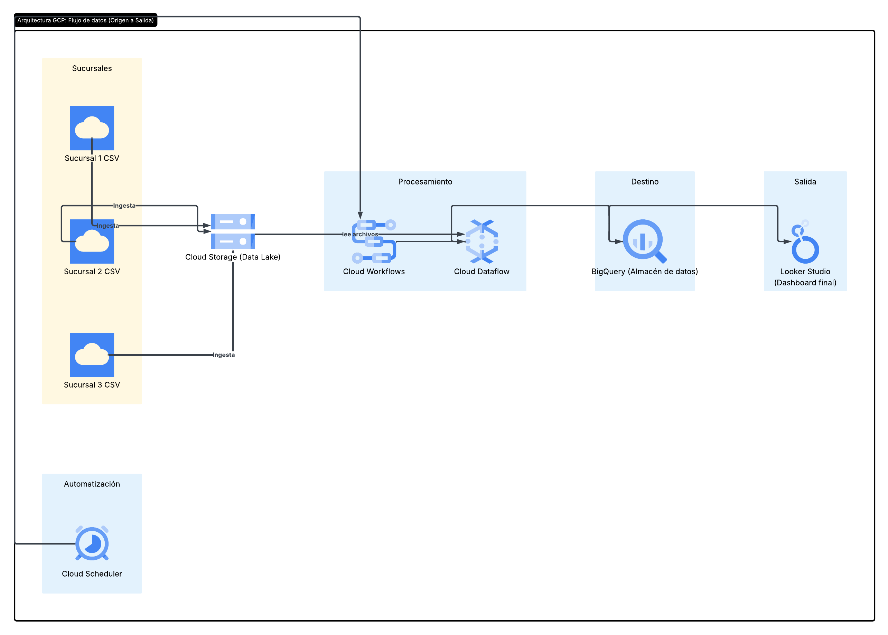

# ☕ Automatización y Análisis de Ventas en la Nube - Cafeterías "Buen Día"

## 1. Problemática (AS-IS)
La cadena de cafeterías "Buen Día" cuenta con 3 sucursales. Al cierre de cada jornada, cada sucursal genera un archivo CSV con el detalle de sus ventas. Actualmente, el negocio enfrenta pérdidas de eficiencia debido a:
* **Procesamiento manual:** El dueño debe unificar los archivos en un Excel local diariamente.
* **Pérdida de historial:** Por limitaciones de rendimiento en Excel, el detalle diario se borra y solo se conservan totales mensuales.
* **Reportes tardíos:** El análisis comercial se realiza solo una vez al mes.

## 2. Arquitectura de la Solución (TO-BE)
Se diseñó e implementó una arquitectura moderna de datos del tipo **ELT (Extract, Load, Transform)** en Google Cloud Platform (GCP) para automatizar el proceso de punta a punta.

### Componentes y Justificación:
* **Cloud Storage (Data Lake):** Repositorio centralizado donde las sucursales suben sus archivos CSV diarios de forma segura y económica.
* **Cloud Scheduler:** Temporizador serverless encargado de disparar el proceso de forma automática todas las noches a las 23:30.
* **Cloud Workflows (Orquestador):** Actúa coordinando la ejecución de los servicios y manejando posibles errores de red.
* **Cloud Dataflow (Procesamiento):** Motor encargado de leer los datos crudos, limpiar formatos de fecha corruptos, estandarizar nombres de productos y unificar la información en paralelo.
* **BigQuery (Data Warehouse):** Base de datos analítica masiva donde se almacena todo el histórico detallado de ventas, permitiendo consultas SQL en milisegundos.
* **Looker Studio (BI):** Tablero interactivo conectado a BigQuery para la visualización en tiempo real de las métricas clave de negocio.

## 🔄 3. Flujo de los Datos
1. Las sucursales suben sus archivos `ventas_sucursal_X.csv` al bucket de **Cloud Storage**.
2. **Cloud Scheduler** activa cronológicamente el flujo a la hora programada.
3. **Cloud Workflows** recibe la señal e inicia el job en **Dataflow**.
4. **Dataflow** transforma, limpia e inserta los registros normalizados en **BigQuery**.
5. El dashboard de **Looker Studio** se actualiza automáticamente mostrando el rendimiento comercial del día anterior.
